```{r setup, include=FALSE}
options(htmltools.dir.version = FALSE)
knitr::opts_chunk$set(fig.align = "center", message = FALSE
                      # , cache = TRUE # for fast builds
                      )
```

```{r xaringan-themer, include=FALSE, warning=FALSE, eval=FALSE}
# remotes::install_github("gadenbuie/xaringanthemer")
library(xaringanthemer)
style_mono_accent(
  base_color = "#213c47",
  header_font_google = google_font("Josefin Sans"),
  text_font_google   = google_font("PT Sans Narrow"),
  code_font_google   = google_font("Source Code Pro"),
  header_background_auto = TRUE,
  header_h1_font_size = "2rem",
  header_h2_font_size = "1.8rem",
  header_h3_font_size = "1.6rem",
  header_background_padding = "15px",
  header_background_content_padding_top = "4.5rem",
  outfile = "lecture/xaringan-themer.css"
)
```


class: inverse, left, bottom
# Hello!

---
# Hi, I'm Robin

<!-- ... -->

---
# Hi, I'm Jakub

.pull-left[
Website: https://nowosad.github.io/

Twitter: [jakub_nowosad](https://twitter.com/jakub_nowosad)

1. [I am an assistant professor in the Department of Geoinformation at the Adam Mickiewicz University in Poznań](https://nowosad.github.io/publications/)
2. [I am a co-author of the Geocomputation with R book](https://geocompr.github.io/)
3. [I create R packages](https://nowosad.github.io/projects/)
]

.pull-right[
```{r, purl=FALSE,echo=FALSE, out.width="40%", fig.align='default'}
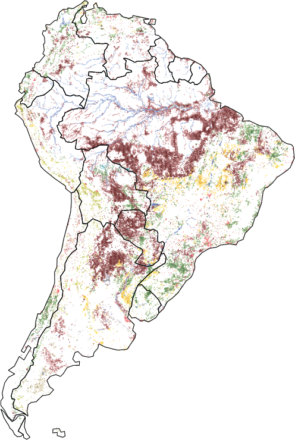
knitr::include_graphics("figs/cover.png")
knitr::include_graphics("figs/logo-landscapemetrics.png")
knitr::include_graphics("figs/logo-sabre.png")
```
]

---

# Housekeeping

## Where to ask questions: 

- GithHub https://github.com/Nowosad/SIGR2021

---
class: inverse, left, bottom
# GIS ecosystem of R


---
# R spatial
.left-column[
- Ecology
- Earth-Observation
- Economics
- Demography
- Politics
- Journalism
- Archeology
- Transport
- Climatology
- Meteorology
- Geomorphometry
- Hydrology
- Urban-Planning
- Mining
- Marine-Studies
- Soil-Science
- Tourism
- and many more...
]
.rc[
<a href="https://www.tylermw.com/3d-maps-with-rayshader/">
```{r, out.width="85%", echo=FALSE}
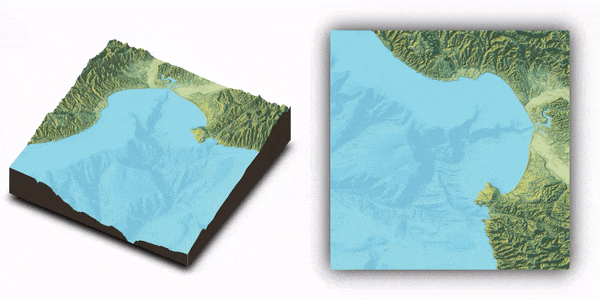
```
</a>
<a href="https://www.mdpi.com/2306-5729/4/3/92">
```{r, echo=FALSE, out.width="85%"}
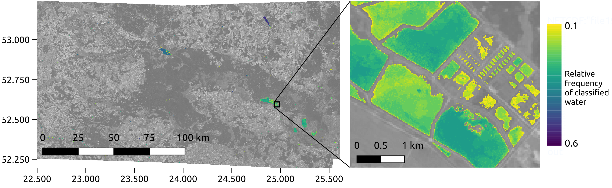
```
</a>
]

---
# R spatial

.pull-left[

- Spatial aspect can be important in any part of data analysis - data preparation, vizualization, modeling, or communicating the results
- It does not need to be the most important part
- R is great to integrate various aspects of analysis

<a href=" https://ikashnitsky.github.io/2018/the-lancet-paper/">
```{r, out.width="90%", echo=FALSE}
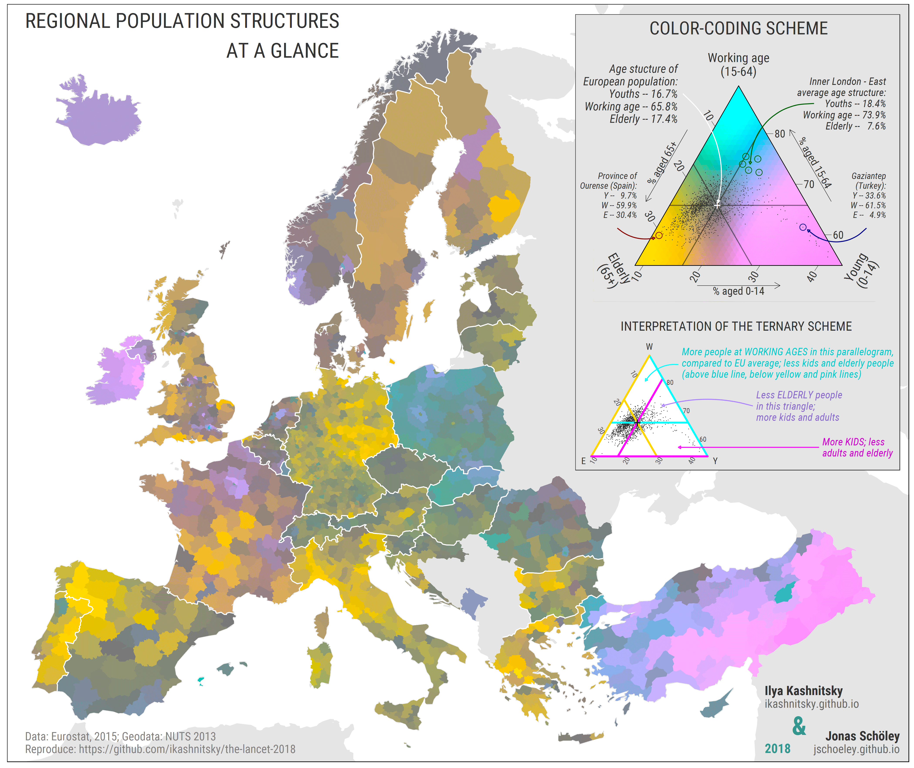
```
</a>

]

.pull-right[
<a href="https://riatelab.github.io/MDM/">
```{r, echo=FALSE}
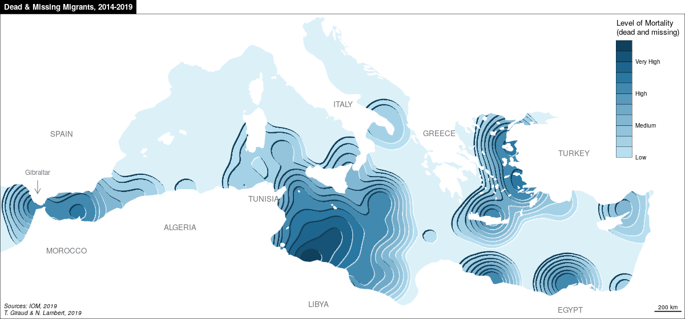
```
</a>
<br>
<a href="https://www.pct.bike/">
```{r, echo=FALSE}
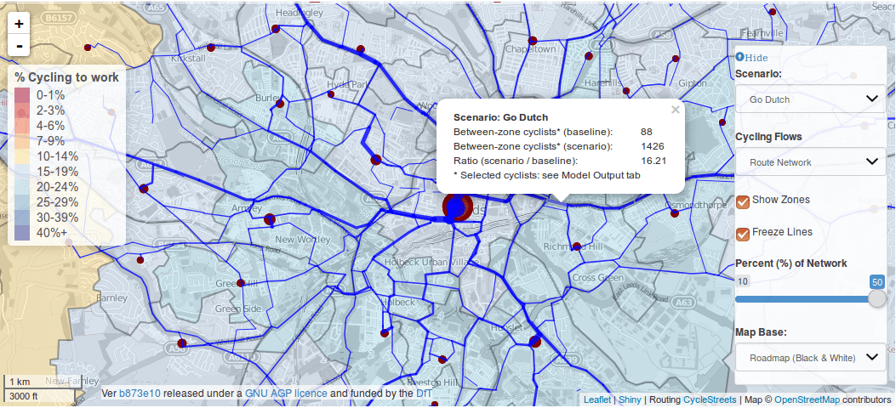
```
</a>
]

---
# R spatial

.pull-left[
<a href="https://github.com/mtennekes/tmap/tree/master/demo/ClassicMap">
```{r, echo=FALSE}
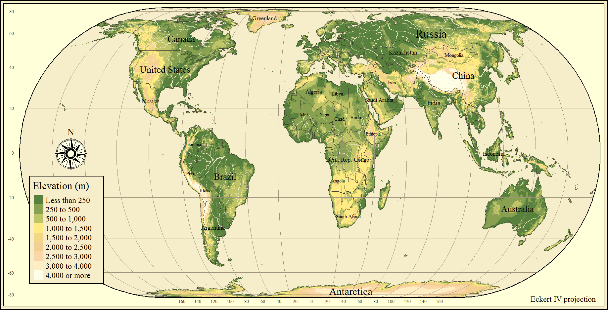
```
</a>
<a href="https://github.com/Z3tt/30DayMapChallenge">
```{r, echo=FALSE}
knitr::include_graphics("figs/Zones_TimezonesEarth.png")
```
</a>
]

.pull-right[
- https://geocompr.github.io/
- https://www.rspatial.org/
- https://www.r-spatial.org/
- `#rspatial` and `#geocompr` on Twitter

<a href="https://nowosad.github.io/post/maps-distortion/">
```{r, echo=FALSE}
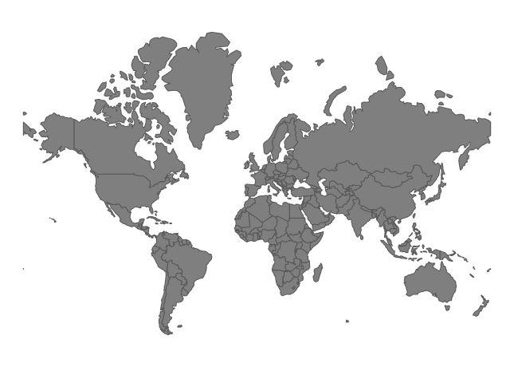
```
</a>
]


---
# R packages

- [**sf**](https://github.com/r-spatial/sf),
[**sp**](https://github.com/edzer/sp),
[**terra**](https://github.com/rspatial/terra),
[**raster**](https://github.com/rspatial/raster), [**stars**](https://github.com/r-spatial/stars) - spatial classes
- [**dplyr**](https://github.com/tidyverse/dplyr), [**rmapshaper**](https://github.com/ateucher/rmapshaper) - processing of attribute tables/geometries 
- [**rnaturalearth**](https://github.com/ropensci/rnaturalearth), [**osmdata**](https://github.com/ropensci/osmdata), [**getlandsat**](https://github.com/ropensci/getlandsat) - spatial data download
- [**rgrass7**](https://github.com/rsbivand/rgrass7), [**qgisprocess**](https://github.com/paleolimbot/qgisprocess), [**RSAGA**](https://github.com/r-spatial/RSAGA), [**link2GI**](https://github.com/r-spatial/link2GI) - connecting with GIS software
- [**gstat**](https://github.com/r-spatial/gstat), [**mlr3**](https://github.com/mlr-org/mlr3), [**CAST**](https://github.com/HannaMeyer/CAST) - spatial data modeling
- [**rasterVis**](https://github.com/oscarperpinan/rastervis), [**tmap**](https://github.com/mtennekes/tmap), [**ggplot2**](https://github.com/tidyverse/ggplot2) - static visualizations
- [**leaflet**](https://github.com/rstudio/leaflet), [**mapview**](https://github.com/r-spatial/mapview), [**mapdeck**](https://github.com/SymbolixAU/mapdeck) - interactive visualizations
- many more...

Learn more at https://cran.r-project.org/web/views/Spatial.html.

---
# R packages - specialized packages

- [**spatstat**](http://spatstat.org/)
- [**spdep**](https://github.com/r-spatial/spdep)
- [**spatialreg**](https://github.com/r-spatial/spatialreg)
- [**dismo**](https://github.com/rspatial/dismo)
- [**landscapemetrics**](https://github.com/r-spatialecology/landscapemetrics) - part of https://github.com/r-spatialecology
- [**RStoolbox**](http://bleutner.github.io/RStoolbox/rstbx-docu/RStoolbox.html)
- [**rayshader**](https://github.com/tylermorganwall/rayshader)
- [**gdalcubes**](https://github.com/appelmar/gdalcubes_R)
- many more...

Learn more at https://cran.r-project.org/web/views/Spatial.html, https://cran.r-project.org/web/views/Environmetrics.html, and https://cran.r-project.org/web/views/SpatioTemporal.html.

---
# R packages 

- [How to cite R packages?](https://neuropsychology.github.io/psycho.R//2018/08/31/cite_packages.html)

```{r}
# citation()
citation("tmap")
```


---
# R spatial infrastructure

<a href="https://www.r-spatial.org/r/2020/03/17/wkt.html">
```{r, echo=FALSE, out.width="75%", fig.align="center"}
knitr::include_graphics("figs/sf-infrastructure.png")
```
</a>

---
# OSGeo libraries

.left-column[
**[PROJ](https://www.osgeo.org/projects/proj/)**

- "conversion of coordinates"
- First versions in [1970s](https://en.wikipedia.org/wiki/PROJ#cite_note-Kresse_Danko_2011_p._948-3)

**[GDAL](https://www.osgeo.org/projects/gdal/)**

- Geospatial Data Abstraction Library, first release 2000
- "200+ geospatial data formats"

**[GEOS](https://www.osgeo.org/projects/gdal/)**

- Geometry Engine – Open Source
- "spatial predicate functions and spatial operators"
]
.right-column[
<a href="https://www.osgeo.org/">
```{r, echo=FALSE, out.width="60%"}
knitr::include_graphics("https://www.osgeo.org/wp-content/themes/roots/assets/img/logo-osgeo.svg")
```
</a>

```{r, echo=FALSE, out.width="90%", fig.cap="GEOS build matrix"}
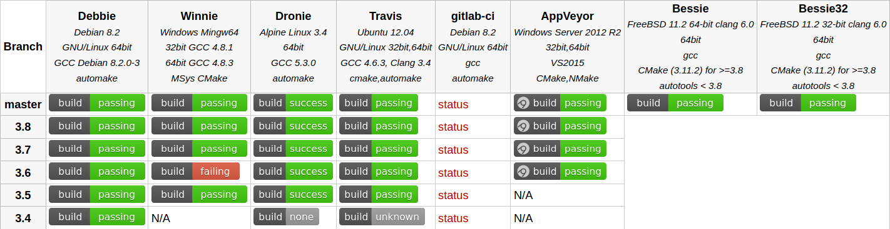
```

.caption[Source: https://trac.osgeo.org/geos]

- Access to these three libraries used to require **sp**, **rgdal** and **rgeos**
- Now **sf** provides a unified access to all three 🎉

]


---
# R-GIS bridges

You can call GIS algorithms directly from R using **qgisprocess**, **rgrass7**, **RSAGA**, or **arcgisbinding**.

```{r, echo=FALSE, out.width="80%"}
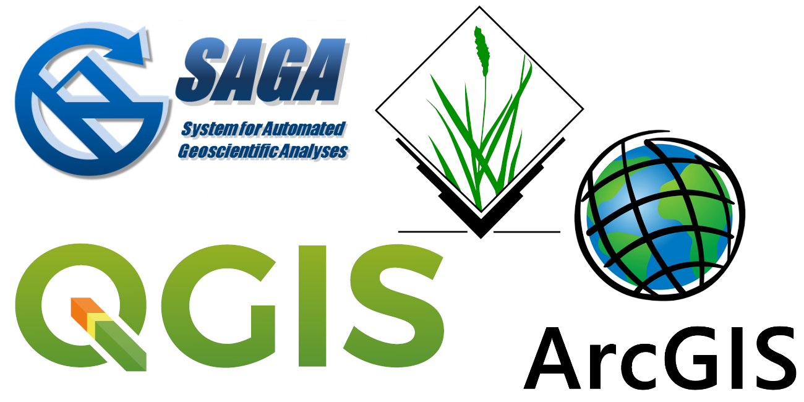
```


---
class: inverse, left, bottom
# Vector data model

<!-- ... -->

---
class: inverse, left, bottom
# Raster data model


---
# Raster data model ecosystem of R

.pull-left[
**raster** and its successor **terra**

```{r, echo=FALSE, out.width="40%"}
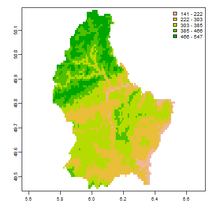
```


- The **terra** package contains classes and methods representing raster objects
- It allows raster data to be loaded and saved
- It allows raster algebra and raster processing
- It includes a number of additional functions, e.g., for analysis of terrain characteristics
- It allows you to work on large sets of data
- ?`terra-package`, https://rspatial.github.io/terra/reference/terra-package.html
- It is a successor of the **raster** package - http://www.rpubs.com/etiennebr/visualraster
]

--

.pull-right[
**stars**

```{r, echo=FALSE, out.width="80%"}
knitr::include_graphics("figs/cube2.png")
```


- The **stars** package contains classes and methods representing spatiotemporal data (raster and vector data cubes)
- It allows raster data to be loaded and saved
- It allows raster processing
- It allows you to work on large sets of data
- It supports regular, rotated, sheared, rectilinear and curvilinear rasters
- https://r-spatial.github.io/stars/
]

---
# terra

The **terra** package contains classes and methods representing raster objects

```{r 05-rspatial-classes-11 }
library(spData)
library(terra)

rast(elev)
```

---
# terra

```{r 05-rspatial-classes-12 }
plot(elev)
```

---
# terra

```{r}
elev[]
```

---
# terra

```{r 05-rspatial-classes-13 }
raster_filepath = system.file("raster/srtm.tif", package = "spDataLarge")
new_raster = rast(raster_filepath)
new_raster
```

---
# terra

```{r 05-rspatial-classes-14, fig.height=5}
raster_filepath2 = system.file("raster/landsat.tif", package = "spDataLarge")
new_raster2 = rast(raster_filepath2)
plot(new_raster2)
```

---
# terra

```{r}
plotRGB(new_raster2, r = 3, g = 2, b = 1, stretch = "lin")
```

---
# terra

.lc2[
```{r 05-rspatial-classes-17}
my_raster = rast(nrows = 10, ncols = 20, 
                 xmin = 0, xmax = 20, ymin = -10, ymax = 0,
                 crs = "EPSG:4326",
                 vals = 1:200)
my_raster

```
]

.rc2[
```{r}
plot(my_raster)
```
]

---
# terra

.lc2[
```{r 05-rspatial-classes-18}
my_raster2 = rast(res = c(1, 1),
                   xmin = 0, xmax = 20, ymin = -10, ymax = 0,
                   crs = "EPSG:4326",
                   vals = 1:200)
my_raster2
```
]
.rc2[
```{r}
plot(my_raster2)
```
]

--

More about **terra** on Friday!


```{r setup2, include=FALSE, purl=FALSE}
options(htmltools.dir.version = FALSE)
knitr::opts_chunk$set(fig.align = "center", cache = FALSE, fig.height = 5, echo = TRUE)
knitr::opts_chunk$set(root.dir = normalizePath("."))
```

```{r, purl=FALSE,echo=FALSE, message=FALSE}
library(sf)
## sfc objects creation ---------
point_sfc = st_sfc(st_point(c(1, 1)), crs = 4326)
linestring_sfc = st_sfc(st_linestring(rbind(c(0.8, 1), c(0.8, 1.2), c(1, 1.2))), crs = 4326)
polygon_sfc = st_sfc(st_polygon(list(rbind(
  c(1.2, 0.6), c(1.4, 0.6), c(1.4, 0.8), c(1.2, 0.8), c(1.2, 0.6)
))), crs = 4326)
multipoint_sfc = st_sfc(st_multipoint(rbind(c(1, 0.6), c(1.4, 1.1))), crs = 4326)
multipoint_sfc2 = multipoint_sfc - 0.5
multilinestring_sfc = st_sfc(st_multilinestring(list(rbind(
  c(1.2, 1), c(1.2, 1.4)
),
rbind(
  c(1.4, 0.4), c(1.6, 0.6), c(1.6, 0.8)
))), crs = 4326)
multipolygon_sfc = st_sfc(st_multipolygon(list(list(rbind(
  c(1.4, 1.2), c(1.6, 1.4), c(1.4, 1.4), c(1.4, 1.2)
)),
st_polygon(
  list(rbind(
    c(0.6, 0.6), c(0.9, 0.6), c(0.9, 0.9), c(0.6, 0.9), c(0.6, 0.6)
  ),
  rbind(
    c(0.7, 0.7), c(0.8, 0.8), c(0.8, 0.7), c(0.7, 0.7)
  ))
))),
crs = 4326)

## sf objects creation ---------
point_sf = st_sf(geometry = point_sfc)
linestring_sf = st_sf(geometry = linestring_sfc)
polygon_sf = st_sf(geometry = polygon_sfc)
multipoint_sf = st_sf(geometry = c(multipoint_sfc, multipoint_sfc2))
multilinestring_sf = st_sf(geometry = multilinestring_sfc)
multipolygon_sf = st_sf(geometry = multipolygon_sfc)
geometrycollection_sf = st_cast(
  c(
    point_sfc,
    linestring_sfc,
    polygon_sfc,
    multipoint_sfc,
    multilinestring_sfc,
    multipolygon_sfc
  ),
  "GEOMETRYCOLLECTION"
)
```


---
class: inverse, left, bottom
# Mapping ecosystem of R

---
# Mapping ecosystem of R

.pull-left[
Static maps:

- **graphics**
<!-- - **rasterVis** -->
- **ggplot2**
- **ggspatial**
- **mapsf**
- **cartography**
- ...

Interactive maps:

- **leaflet**
- **mapview**
- **mapdeck**
- ...
]

.pull-right[
Both:

- **tmap**

Specific-purpose mapping:

- **cartogram**
- **geofacet**
- **geogrid**
- **rayshader**
- ...
]

---
# Mapping ecosystem of R

.pull-left[
**tmap** - tmap is an R package for drawing thematic maps

Its API is based on A Layered Grammar of Graphics 

https://www.jstatsoft.org/article/view/v090c01

```{r 01, eval=FALSE}
library(sf)
library(tmap)
nz = read_sf("data/new_zealand.gpkg")
nz_ports = read_sf("data/nz_ports.gpkg")
tm_shape(nz) + #<<
  tm_graticules() +
  tm_polygons(col = "Median_income") + #<<
  tm_shape(nz_ports) + #<<
  tm_dots(size = 0.75) + #<<
  tm_scale_bar(breaks = c(0, 100, 200)) +
  tm_compass(position = c("right", "top")) +
  tm_layout(bg.color = "lightblue")
```

**Shapes and layers**
]


.pull-right[
```{r plot-label-out1, ref.label="01", echo=FALSE, message=FALSE, fig.width = 7, fig.height = 7}
```
]

---
# Mapping ecosystem of R

.pull-left[
```{r 01b, eval=FALSE}
library(sf)
library(tmap)
nz = read_sf("data/new_zealand.gpkg")
nz_ports = read_sf("data/nz_ports.gpkg")
tm_shape(nz) + 
  tm_graticules() +
  tm_polygons(col = "Median_income") +
  tm_shape(nz_ports) +
  tm_dots(size = 0.75) +
  tm_scale_bar(breaks = c(0, 100, 200)) + #<<
  tm_compass(position = c("right", "top")) + #<<
  tm_layout(bg.color = "lightblue")
```

**Attributes layers**
]


.pull-right[
```{r plot-label-out1b, ref.label="01", echo=FALSE, message=FALSE, fig.width = 7, fig.height = 7}
```
]


---
# Mapping ecosystem of R

.pull-left[
```{r 01c, eval=FALSE}
library(sf)
library(tmap)
nz = read_sf("data/new_zealand.gpkg")
nz_ports = read_sf("data/nz_ports.gpkg")
tm_shape(nz) + 
  tm_graticules() + #<<
  tm_polygons(col = "Median_income") +
  tm_shape(nz_ports) +
  tm_dots(size = 0.75) +
  tm_scale_bar(breaks = c(0, 100, 200)) +
  tm_compass(position = c("right", "top")) +
  tm_layout(bg.color = "lightblue") #<<
```

**Other**

More about **tmap** during the workshop.
]


.pull-right[
```{r plot-label-out1c, ref.label="01", echo=FALSE, message=FALSE, fig.width = 7, fig.height = 7}
```
]


---
# graphics

.pull-left[
```{r 02, eval=FALSE}
plot(nz)
```
]

.pull-right[
```{r plot-label-out2, ref.label="02", echo=FALSE, message=FALSE, fig.width = 7, fig.height = 7}
```
]

---
# graphics

.pull-left[
```{r 03, eval=FALSE}
plot(st_geometry(nz))
```
]

.pull-right[
```{r plot-label-out3, ref.label="03", echo=FALSE, message=FALSE, fig.width = 7, fig.height = 7}
```
]

---
# graphics

.pull-left[
```{r 04, eval=FALSE}
library(RColorBrewer)
par(bg = "lightblue")
g = st_graticule(nz, lon = c(170, 175),
                 lat = c(-45, -40, -35))
plot(nz["Median_income"],
     graticule = g,
     axes = TRUE, 
     reset = FALSE,
     main = "Median income",
     breaks = c(22000, 24000, 26000, 28000,
                30000, 32000, 34000),
     pal = brewer.pal(6, "YlOrRd"))
plot(st_geometry(nz_ports), add = TRUE)
```
]

.pull-right[
```{r plot-label-out4, ref.label="04", echo=FALSE, message=FALSE, fig.width = 7, fig.height = 7}
```
]

---
# ggplot2

.pull-left[
```{r 05, eval=FALSE}
library(ggplot2)
ggplot() +
  geom_sf(data = nz, aes(fill = Median_income)) +
  geom_sf(data = nz_ports, size = 3) +
  scale_fill_distiller(palette = "YlOrRd",
                       direction = 1,
                       name = "Median Income") +
  theme(panel.background =
          element_rect(fill = "lightblue"))
```
]

.pull-right[
```{r plot-label-out5, ref.label="05", echo=FALSE, message=FALSE, fig.width = 7, fig.height = 7}
```
]

---
# ggplot2

.pull-left[
```{r 06, eval=FALSE}
library(ggplot2)
ggplot() +
  geom_sf(data = nz, aes(fill = Median_income)) +
  geom_sf(data = nz_ports, size = 3) +
  scale_fill_distiller(palette = "YlOrRd",
                       direction = 1,
                       name = "Median Income") +
  scale_x_continuous(breaks = c(170, 175, 180)) +
  theme(panel.background = 
          element_rect(fill = "lightblue"))
```
]

.pull-right[
```{r plot-label-out6, ref.label="06", echo=FALSE, message=FALSE, fig.width = 7, fig.height = 7}
```
]

---
# ggspatial

.pull-left[
```{r 08, eval=FALSE}
library(ggspatial)
ggplot() +
  geom_sf(data = nz, aes(fill = Median_income)) +
  geom_sf(data = nz_ports, size = 3) +
  scale_fill_distiller(palette = "YlOrRd",
                       direction = 1,
                       name = "Median Income") +
  scale_x_continuous(breaks = c(170, 175, 180)) +
  annotation_scale(location = "br") +
  annotation_north_arrow(location = "tr",
                         which_north = "true") +
  theme(panel.background = 
          element_rect(fill = "lightblue"))
```
]

.pull-right[
```{r plot-label-out8, ref.label="08", echo=FALSE, message=FALSE, fig.width = 7, fig.height = 7}
```
]

---
# mapsf


.pull-left[
```{r 09, eval=FALSE}
library(mapsf)
g = st_graticule(nz, lon = c(170, 175),
                 lat = c(-45, -40, -35))
mf_map(g,
       bg = "lightblue")
mf_map(x = nz, 
       var = "Median_income",
       type = "choro",
       breaks = "pretty",
       leg_title = "Median income",
       pal = "YlOrRd",
       add = TRUE)
mf_arrow(pos = "topright")
mf_scale()
```
]

.pull-right[
```{r plot-label-out9, ref.label="09", echo=FALSE, message=FALSE, fig.width = 7, fig.height = 7}
```
]

---
# leaflet

.pull-left[
```{r 10, eval=FALSE}
library(leaflet)
leaflet(nz) %>%
  addTiles() %>%
  addPolygons()
```
]

.pull-right[
```{r plot-label-out10, ref.label="10", echo=FALSE, message=FALSE, fig.width = 7, fig.height = 7, warning=FALSE}
```
]

---
# leaflet

.pull-left[
```{r 11, eval=FALSE}
library(leaflet)
nz4326 = st_transform(nz, 4326)
nz_ports4326 = st_transform(nz_ports, 4326)
pal = colorBin("YlOrRd",
               domain = nz4326$Median_income)
leaflet(nz4326) %>%
  addTiles() %>% 
  addPolygons(fillOpacity = 1,
          weight = 1,
          fillColor = ~pal(Median_income)) %>% 
  addLegend(pal = pal,
            values = ~Median_income, 
            opacity = 1,
            title = "Median income") %>% 
  addCircleMarkers(data = nz_ports4326)
```
]

.pull-right[
```{r plot-label-out11, ref.label="11", echo=FALSE, message=FALSE, fig.width = 7, fig.height = 7, warning=FALSE}
```
]

---
# mapview

.pull-left[
```{r 12, eval=FALSE}
library(mapview)
mapview(nz["Median_income"]) +
  st_geometry(nz_ports)
```
]

.pull-right[
```{r plot-label-out12, ref.label="12", echo=FALSE, message=FALSE, fig.width = 7, fig.height = 7}
```
]


---
# mapview

.pull-left[
```{r 13, eval=FALSE}
library(mapview)
library(RColorBrewer)
mapview(nz, 
        zcol = "Median_income",
        layer.name = "Median income",
        col.regions = brewer.pal(7, "YlOrRd")) +
  st_geometry(nz_ports)
```
]

.pull-right[
```{r plot-label-out13, ref.label="13", echo=FALSE, message=FALSE, fig.width = 7, fig.height = 7, warning=FALSE}
```
]

---
# mapdeck

.pull-left[
```{r 14, eval=FALSE}
library(mapdeck)
nz4326 = st_transform(nz, 4326)
nz4326$elev = (nz4326$Median_income/1000)^3.5
# Sys.setenv(MAPBOX_API_KEY = "xxxxxxxxxx")
mapdeck(style = mapdeck_style("dark")) %>%
  add_polygon(data = nz4326,
              layer = "polygon_layer",
              fill_colour = "Median_income",
              elevation = "elev"
              )
```
]

.pull-right[
```{r plot-label-out14, ref.label="14", echo=FALSE, message=FALSE, fig.width = 7, fig.height = 7, warning=FALSE}
```
]

---
# ggplot2 (+ gganimate)

.pull-left[
```{r 15, eval=FALSE}
library(ggplot2)
library(sf)
pzn_districts = read_sf("data/pzn_districts.gpkg")
pzn_air = read_sf("data/pzn_pm10.gpkg")
gp1 = ggplot() +
  geom_sf(data = pzn_districts) +
  geom_sf(data = pzn_air, aes(size = PM10_avg))
gp1
```
]

.pull-right[
```{r plot-label-out15, ref.label="15", echo=FALSE, message=FALSE, fig.width = 7, fig.height = 7, warning=FALSE}
```
]

---
# ggplot2 (+ gganimate)

.pull-left[
```{r, eval=FALSE}
library(gganimate)
gp2 = gp1 + 
  transition_time(Date) +
  labs(title = "Date: {frame_time}") + 
  ease_aes("linear") +
  shadow_wake(wake_length = 0.1,
              alpha = FALSE)
gp2
```
]

.pull-right[
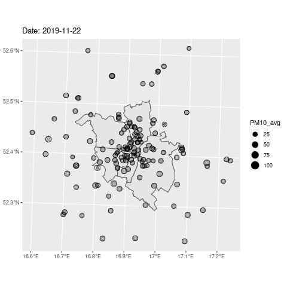
]

```{r, purl=FALSE, echo=FALSE, eval=FALSE}
gp2 = gp1 + 
  transition_time(Date) +
  labs(title = "Date: {frame_time}") + 
  ease_aes("linear") +
  shadow_wake(wake_length = 0.1, alpha = FALSE)
# gp2
anim_save(filename = "lecture/figs/gp2.gif", gp2)
```

---
# Other mapping packages

.pull-left[
https://github.com/sjewo/cartogram
```{r, echo=FALSE}
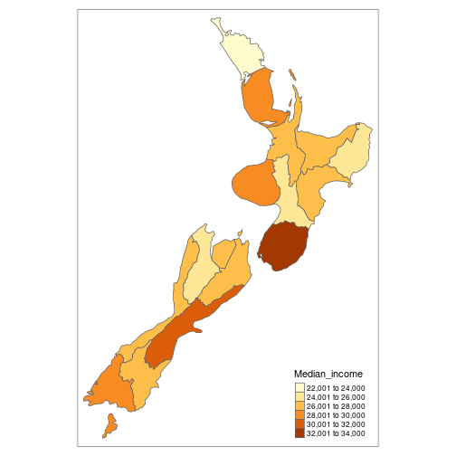
```
]
.pull-right[
https://hafen.github.io/geofacet/
```{r, echo=FALSE}
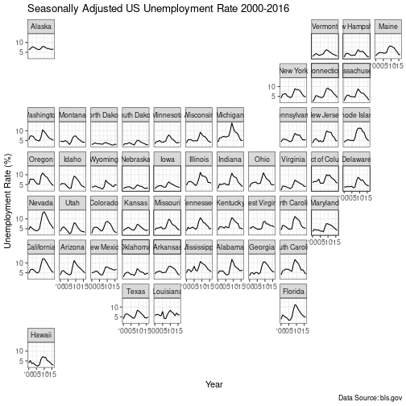
```
]


---
# Other mapping packages

.pull-left[
https://github.com/schochastics/edgebundle
```{r, echo=FALSE}
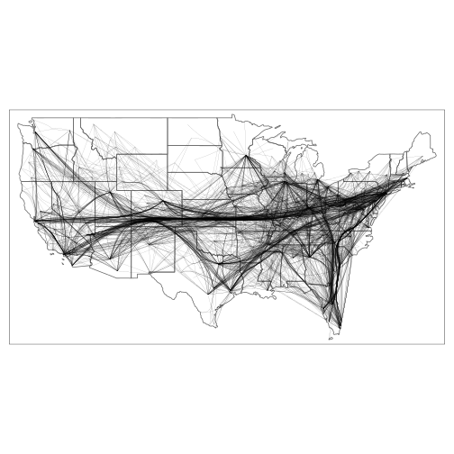
```
]
.pull-right[
https://www.rayshader.com/
```{r, echo=FALSE}
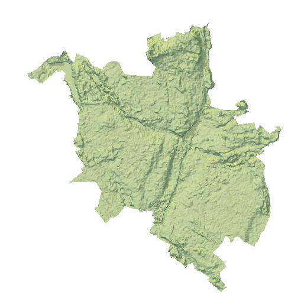
```
]


---
class: inverse, left, bottom
# Coordinate reference systems

---
class: clear

## Understanding coordinate reference systems (CRSs)

- To check if the data has CRS
- To understand the data
- To decide if reprojection is needed

---
# Coordinates - numbers describing positions in space

.pull-left[
**Geographic coordinates**: angles (degrees; longitude and latitude) pointing out locations on a spherical or ellipsoidal surface (*ellipsoid - a mathematical approximation of the size and shape of the earth*)

```{r, warning=FALSE, purl=FALSE,echo=FALSE}
library(tmap)
library(sf)
polygon_sf$id = as.factor(c(1))
polygon_sf_af = polygon_sf
polygon_sf_af$geometry = polygon_sf_af$geometry + c(20, 40)
polygon_sf_afp = st_cast(polygon_sf_af, "MULTIPOINT")
tm_shape(polygon_sf_af) +
  tm_graticules() + 
  tm_polygons(col = "id", lwd = 7) +
  tm_shape(polygon_sf_afp) +
  tm_dots(size = 1) +
  tm_layout(main.title = "Geographic coordinates", legend.show = FALSE, inner.margins = 0.15) +
  tm_xlab("Longitude", space = 0.5) + 
  tm_ylab("Latitude", space = 0.5)
```
]

.pull-right[
**Projected coordinates**: measured on a two-dimensional flat space (e.g. in meters; x and y), related to an ellipsoid by projection

```{r, purl=FALSE,echo=FALSE, warning=FALSE}
library(tmap)
polygon_sf_p = st_cast(polygon_sf, "MULTIPOINT")
tm_shape(polygon_sf) +
  tm_grid() + 
  tm_polygons(col = "id", lwd = 7) +
  tm_shape(polygon_sf_p) +
  tm_dots(size = 1) +
  tm_layout(main.title = "Projected coordinates", legend.show = FALSE, inner.margins = 0.15) +
  tm_xlab("X", space = 0.5) + 
  tm_ylab("Y", space = 0.5)
```
]


---
# Coordinate reference system (CRS)

**Coordinate reference system: a set of information describing the system used to locate objects in space.**

**It includes:**

- a set of mathematical rules for specifying how coordinates are to be assigned to points
- a set of parameters that define the position of the origin, the scale, and the orientation of a coordinate system (a datum)

----

**Two main groups of CRS:**

- Geographic coordinate reference systems, GCRS - composed of an ellipsoid and a datum; units in degrees
- Projected coordinate reference systems, PCRS - based on a GCRS and a projection

---
# Coordinate reference system (CRS)

- **Geographic coordinate reference systems** - identify any location on the Earth’s surface using two values - longitude and latitude
- The surface of the Earth in geographic coordinate systems is represented by a spherical or ellipsoidal surface
- There are two types of datum — geocentric and local

```{r, purl=FALSE,echo=FALSE, fig.cap = "Source: http://desktop.arcgis.com/en/arcmap/10.3/guide-books/map-projections/datums.htm", out.width="65%"}
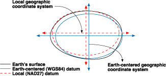
```


---
# Why do we need projected coordinates?

```{r, purl=FALSE,echo=FALSE, warning=FALSE}
library(tmap)
library(sf)
world_gr = st_graticule(ndiscr = 9999,
                                  lon = seq(-90, 90, 10),
                                  lat = seq(-180, 180, 10))

ortho_crs = st_crs("+proj=ortho")
world_gr2 = st_transform(world_gr, crs = ortho_crs)
tm1 = tm_shape(world_gr2) +
  tm_lines() +
  tm_layout(inner.margins = 0.05, 
            frame = FALSE, 
            outer.margins = 0)

grid_sf = st_make_grid(world_gr2)
tm2 = tm_shape(grid_sf) +
  tm_polygons(alpha = 0) +
  tm_layout(inner.margins = 0.05, 
            frame = FALSE, 
            outer.margins = 0)
```


.pull-left[
**Geographic coordinates**
```{r, purl=FALSE,echo=FALSE, warning=FALSE, fig.height=6, fig.width=6}
tm1
```
]

.pull-right[
**Projected coordinates**
```{r, purl=FALSE,echo=FALSE, warning=FALSE, fig.height=6, fig.width=6}
tm2
```
]

---
# Coordinate reference system (CRS)

.lc[
- **Projected coordinate reference systems**
- Projected CRSs use Cartesian coordinates on an implicitly flat surface
- Projected CRSs are based on a geographic CRS and rely on map projections to convert the three-dimensional surface of the Earth into x and y values
- http://www.manifold.net/doc/mfd9/projections_tutorial.htm
]

.rc[
```{r, purl=FALSE,echo=FALSE, fig.cap = "Source: https://giscommons.org/earth-and-map-preprocessing/", out.width="55%"}
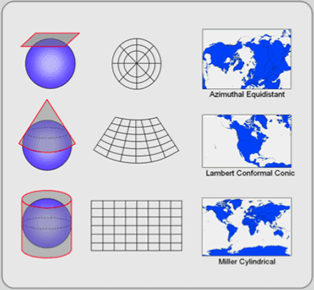
```
]


---
# Coordinate reference system (CRS)

- **Projected coordinate reference systems**
- [Some properties of the Earth’s surface are distorted in this process, such as area, direction, distance, and shape](https://www.youtube.com/watch?v=kIID5FDi2JQ)

```{r, purl=FALSE,echo=FALSE, fig.cap = "Source: https://ihatecoordinatesystems.com/", out.width="70%"}
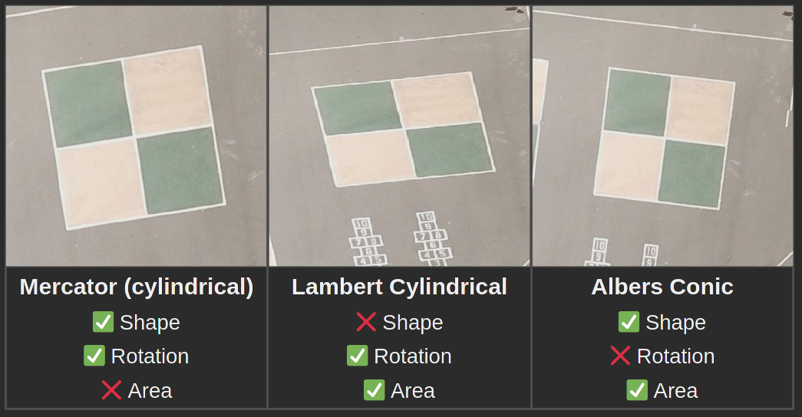
```

---
# How to describe CRS?

.pull-left[
**Two main current methods (see on the right):**

- CRS codes, e.g., EPSG:4326
- `WKT2`

**One (currently discouraged in most cases) method:**

- `proj4string` - `r st_crs(4326)$proj4string`

----

*More information:*

- https://proj.org/usage/projections.html
- https://spatialreference.org/ref/epsg/
- https://www.youtube.com/watch?v=Va0STgco7-4 (especially 10:47-27:48)
- https://www.gaia-gis.it/fossil/libspatialite/wiki?name=PROJ.6
- https://ihatecoordinatesystems.com/
]

.pull-right[
.tiny[
```{r, purl=FALSE,echo=FALSE}
st_crs(4326)
```
]
]


```{r, results="asis", purl=FALSE,echo=FALSE, eval=FALSE}
crs_data = rgdal::make_EPSG()

st_crs(crs_data$code[[4326]])
crs_data %>% 
  dplyr::select(epsg = code, proj4string = prj4) %>%
  dplyr::filter(epsg %in% c(4326, 2163, 27700, 2180)) %>% 
  knitr::kable(format = "html")
```

<!-- A coordinate reference sytem (CRS) describes how coordinates are to be interpreted: which location on Earth do they refer to. In case of projected coordinates the CRS contains the projection type and parameters, in all cases which reference ellipsoid the original geographic coordinates are associated with (e.g., WGS84, or NAD27). -->

```{r, purl=FALSE,echo=FALSE, eval=FALSE}
library(spData)
library(sf)
library(lwgeom)
library(tmap)
us_data = us_states
us_data2 = st_transform(us_states, "+proj=longlat +ellps=WGS84 +datum=WGS84")
us_data3 = st_transform(us_states, "+proj=longlat +ellps=GRS80 +datum=NAD83")
us_data4 = st_transform(us_states, "+proj=longlat +ellps=bessel +datum=potsdam")
us_data5 = st_transform(us_states, "+proj=longlat +ellps=airy +datum=OSGB36")

tm_shape(us_data2) +
  tm_borders(col = "red") +
  tm_shape(us_data3) + 
  tm_borders(col = "green") +
  tm_shape(us_data4) +
  tm_borders(col = "yellow") +
  tm_shape(us_data5) + 
  tm_borders(col = "blue")
```

---
class: inverse, left, bottom
# Getting CRS

---
# Getting CRS - vector data

```{r}
library(spData)
library(sf)
```

.pull-left[

.tiny[
```{r}
st_crs(world)
```
]

]

.pull-right[

.tiny[
```{r}
st_crs(world)$proj4string
st_crs(world)$epsg
st_crs(world)$wkt
```

]

]


---
# Getting CRS - raster data


```{r, message=FALSE}
library(spData)
library(terra)
elev = rast(elev)
```

.pull-left[
.tiny[
```{r}
crs(elev, describe = TRUE)
crs(elev)
```
]
]

.pull-right[
.tiny[
```{r}
st_crs(elev)
```
]
]

---
class: clear

## Reprojecting geographic data

Used when we need:

- to change projection of a vector or raster data
- to unify projections of several spatial datasets

## Setting CRS

Used when we need:

- to set CRS to the data for which metadata about CRS is missing
- to change CRS in the data  for which metadata about CRS is incorrect

---
class: inverse, left, bottom
# Reprojecting vectors

---
# Reprojecting vectors

```{r, message=FALSE}
library(sf)
zion = read_sf(system.file("vector/zion.gpkg", package = "spDataLarge"), quiet = TRUE)
data(zion_points, package = "spDataLarge")
```

.pull-left[
```{r, purl=FALSE,echo=FALSE, out.width="80%", purl=FALSE}
library(tmap)
tm_shape(zion) +
  tm_grid() + 
  tm_polygons() 
```
]

.pull-right[
```{r, purl=FALSE,echo=FALSE, out.width="80%"}
library(tmap)
tm_shape(zion_points) +
  tm_grid() + 
  tm_symbols()
```
]

---
# Reprojecting vectors (good approach)

```{r}
zion_points2a = st_transform(zion_points,
                             crs = "EPSG:26912")
```

---
# Reprojecting vectors (even better approach)

```{r}
zion_points3 = st_transform(zion_points, st_crs(zion))
zion_points3
```

---
# Reprojecting vectors

.pull-left[
```{r, purl=FALSE,echo=FALSE}
library(tmap)
tm_shape(zion_points) +
  tm_grid() + 
  tm_symbols()
```
]

.pull-right[
```{r, purl=FALSE,echo=FALSE}
library(tmap)
tm_shape(zion_points3) +
  tm_grid() + 
  tm_symbols()
```
]

<!-- mention lwgeom -->
<!-- https://geocompr.robinlovelace.net/reproj-geo-data.html#modifying-map-projections -->

---
class: inverse, left, bottom
# Reprojecting rasters

---
# Reprojecting rasters

- Different than reprojecting vectors
- Two separate spatial operations: 
    - A vector reprojection of cell centroids to another CRS
    - Computation of new pixel values through resampling

---
# Reprojecting rasters (1)

```{r}
library(terra)
cat_raster = rast(system.file("raster/nlcd2011.tif", package = "spDataLarge"))
crs(cat_raster, describe = TRUE)
```

.pull-left[
```{r}
unique(cat_raster)
```
]

.pull-right[
```{r, purl=FALSE,echo=FALSE, message=FALSE, warning=FALSE}
tm_shape(cat_raster) + 
  tm_raster(drop.levels = TRUE)
```
]

---
# Reprojecting rasters (1)

```{r}
wgs84 = "EPSG:4326"
cat_raster_wgs84 = project(cat_raster, wgs84, method = "near")
```

---
# Reprojecting rasters (1)

.pull-left[
```{r, purl=FALSE,echo=FALSE, message=FALSE, warning=FALSE}
tm_shape(cat_raster) + 
  tm_grid() + 
  tm_raster(drop.levels = TRUE)
```
]

.pull-right[
```{r, purl=FALSE,echo=FALSE, message=FALSE, warning=FALSE}
cat_raster2 = stars::st_as_stars(cat_raster)
cat_raster2 = droplevels(cat_raster2)
tm_shape(cat_raster_wgs84) + 
  tm_grid() + 
  tm_raster(style = "cat", palette = attr(cat_raster2[[1]], "colors")) + 
  tm_layout(legend.show = FALSE)
```
]


---
# Reprojecting rasters (2)

```{r}
con_raster = rast(system.file("raster/srtm.tif", package = "spDataLarge"))
crs(con_raster, describe = TRUE)
```

.pull-left[
```{r}
hist(con_raster)
```
]

.pull-right[
```{r, purl=FALSE,echo=FALSE}
tm_shape(con_raster) + 
  tm_grid() +
  tm_raster(style = "cont",
            legend.show = FALSE)
```
]


---
# Reprojecting rasters (2)

https://projectionwizard.org/

```{r}
equalarea = 'PROJCS["ProjWiz_Custom_Albers",
 GEOGCS["GCS_WGS_1984",
  DATUM["D_WGS_1984",
   SPHEROID["WGS_1984",6378137.0,298.257223563]],
  PRIMEM["Greenwich",0.0],
  UNIT["Degree",0.0174532925199433]],
 PROJECTION["Albers"],
 PARAMETER["False_Easting",0.0],
 PARAMETER["False_Northing",0.0],
 PARAMETER["Central_Meridian",-113.04],
 PARAMETER["Standard_Parallel_1",32.32],
 PARAMETER["Standard_Parallel_2",42.32],
 PARAMETER["Latitude_Of_Origin",37.32],
 UNIT["Meter",1.0]]'
con_raster_ea = project(con_raster, equalarea, method = "bilinear")
crs(con_raster_ea, describe = TRUE)
```


---
# Reprojecting rasters (2)

.pull-left[
```{r, purl=FALSE,echo=FALSE}
tm_shape(con_raster) + 
  tm_grid() + 
  tm_raster(style = "cont") + 
  tm_layout(legend.show = FALSE)
```
]

.pull-right[
```{r, purl=FALSE,echo=FALSE}
tm_shape(con_raster_ea) + 
  tm_grid() + 
  tm_raster(style = "cont") + 
  tm_layout(legend.show = FALSE)
```
]

<!-- mention more methods! -->
<!-- gdal -->

---
class: inverse, left, bottom
# Setting CRS

---
# Setting CRS (vector)

```{r}
vector_filepath = system.file("vector/zion.gpkg", package = "spDataLarge")
new_vector = read_sf(vector_filepath)
st_crs(new_vector) # get CRS
new_vector = st_set_crs(new_vector, "EPSG:4326") # set CRS
```

---
# Setting CRS (raster)

```{r}
raster_filepath = system.file("raster/srtm.tif", package = "spDataLarge")
new_raster = rast(raster_filepath)
crs(new_raster, describe = TRUE) # get CRS
crs(new_raster) = "EPSG:6341" # set CRS
```

---
class: inverse, left, bottom
# Summary

---
# Summary

.pull-left[

]

.pull-right[
## Contact:

`#rspatial`

`#geocompr`

<!-- `r # icons::fontawesome("twitter")` #rspatial -->

<!-- `r # icons::fontawesome("twitter")` #geocompr -->

<!-- `r # icons::fontawesome("twitter")` jakub_nowosad -->

<!-- `r # icons::fontawesome("twitter")` robinlovelace -->

## Resources:

https://geocompr.github.io/

https://nowosad.github.io

https://www.robinlovelace.net/

]